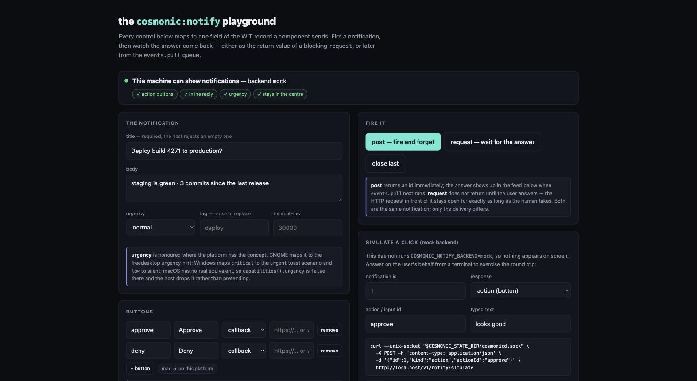

# notify-playground

A hands-on tour of **`cosmonic:notify`** — the interface a WebAssembly component
uses to put a notification, and a question, in front of the person using the
machine.

It serves one page. Click a **message type**, tweak anything you like, fire it,
and watch the answer come back. Every control maps to one field of the WIT
record, the exact JSON going over the wire is shown as you edit, and every host
call the component makes is in one ~40-line file ([`src/notify.rs`](src/notify.rs))
— the sample is meant to be read as much as run.



---

## Run it

You need [Cosmonic Desktop](https://cosmonic.com/downloads) with the
`settings.notifications` flag on (Settings → Labs), and a Rust toolchain with
the `wasm32-wasip2` target.

```sh
rustup target add wasm32-wasip2
cargo build --target wasm32-wasip2 --release
```

Then push it to Desktop's built-in registry and apply the manifest:

```sh
SOCK="$COSMONIC_STATE_DIR/cosmonicd.sock"     # `cosmonicd paths` prints it

wash oci push --insecure oci-registry.localhost:8200/notify-playground:0.2.0 \
  target/wasm32-wasip2/release/notify_playground.wasm

curl --unix-socket "$SOCK" -X POST -H 'content-type: application/json' \
  --data-binary @<(yq -o=json workload.yaml) \
  http://localhost/v1/workloads
```

Open <http://notify.localhost:8200/>.

To run the published build instead of your own, apply
[`deploy/workload.yaml`](deploy/workload.yaml) — same manifest, pointing at
`ghcr.io/cosmonic-labs/notify-playground`.

---

## The message types

The top of the page is a button per notification shape. Clicking the **name**
loads it into the form so you can edit it; clicking **▶** sends it straight
away, with the verb that shape is meant to use.

| | |
|---|---|
| Plain toast | title + body, nothing else |
| Low urgency | quiet: no sound, no interruption |
| Critical alert | stays on screen until answered |
| Two-button decision | approve / deny, answered back to the component |
| Button opens a URL | `action.target = url` — http/https only |
| Button opens Desktop | `action.target = deep-link`, a relative app route |
| Inline reply | a real text box on Windows and macOS |
| Reply + buttons | text box and actions on one notification |
| Body click → URL | `default-target` — clicking the toast itself |
| Replace by tag | send twice; the second replaces the first in place |
| Expires on its own | 4s timeout → a terminal `expired` response |
| Too many buttons | 6 actions → the host truncates to the platform max |
| **Empty title** | *rejected* — a notification must have a title |
| **`javascript:` URL** | *rejected* — url targets are http/https only |
| **Traversing deep link** | *rejected* — a route may not climb out of the app |
| **Duplicate button ids** | *rejected* — action ids must be unique |

The last four are the point as much as the first twelve: **validation runs in
the daemon, not in the page.** A component cannot skip it, and neither can a
model composing a notification through the MCP path.

### Adding your own

The types are one array at the top of the `<script>` in
[`src/index.html`](src/index.html). `n` is literally the JSON body the page
POSTs, so whatever you write is exactly what reaches `cosmonic:notify`:

```js
{
  id: "my-type",
  label: "My message",             // the button
  hint: "what it demonstrates",    // the line under it
  group: "shape",                  // or "refused"
  send: "post",                    // or "request"
  n: {
    title: "Something happened",
    body: "…",
    urgency: "normal",             // low | normal | critical
    actions: [{ id: "ok", label: "OK", target: "callback" }],
    // input: { id, label, placeholder }
    // default_target: { target: "url", value: "https://…" }
    // tag: "…", timeout_ms: 30000
  },
}
```

Add an object, get a button. Nothing else in the file needs to change.

---

## What it demonstrates

| Control | WIT field | What to notice |
|---|---|---|
| title / body | `notification.title`, `.body` | an empty title is rejected by the **host**, not the component — validation is not something a component can skip |
| urgency | `notification.urgency` | honoured where the platform has the concept; `capabilities().urgency` tells you whether it will be |
| buttons | `notification.actions` | truncated to `capabilities().max-actions`, and the host logs what it dropped |
| button target | `action.target` | `callback` answers the component; `url` opens a link; `deep-link` opens Desktop at a route |
| body click | `notification.default-target` | unset means the host's own default: a deep link to the sending workload's page |
| inline reply | `notification.input` | a real text box on Windows and macOS; on GNOME the host degrades it to a button with the same id |
| tag | `notification.tag` | reuse it to **replace** your previous notification in place, rather than stacking a second |
| timeout-ms | `notification.timeout-ms` | bounds how long `request` will block |
| **post** | `notifier.post` | returns an id immediately; the answer arrives later via `events.pull` |
| **request** | `notifier.request` | does not return until the user answers — the HTTP request in front of it stays open that whole time |
| **close** | `notifier.close` | withdraws it; the pending response resolves as `expired` |

### The three things worth taking away

**1. You never get zero answers, and never two.** Every notification resolves to
exactly one terminal response — `activated`, `action`, `reply`, `dismissed`, or
`expired`. If the user walks away, you get `expired`. If the daemon shuts down,
you get `expired`. Write your component around that guarantee rather than around
a timeout of your own.

**2. `post` and `request` are the same notification, delivered differently.**
`request` blocks the invocation. `post` returns an id and the answer lands in a
queue you drain with `events.pull`. The queue is per **workload**, not per
instance — which is the only thing that works for a request-scoped component
like this one, where the invocation that posted is long gone before anyone
clicks.

**3. Ask what the platform can do; don't assume.** `capabilities()` is cheap and
tells the truth, including the uncomfortable truth that sometimes nothing can be
shown at all. Check `available` rather than discovering it one `unavailable`
error at a time.

---

## How do I call back into the Cosmonic product?

Every button (and the notification body) carries an `action-target` saying
what activating it does. Three kinds:

| Target | What the host does | Use it for |
|---|---|---|
| `deep-link` | opens **Cosmonic Desktop** at an app route (`cosmonic://navigate/<route>`) | "show me that workload / setting / lesson" |
| `url` | opens the default **browser** (http/https only) | release notes, dashboards, docs |
| `callback` | nothing host-side | the answer just comes back to your component |

### Deep-link routes the app recognises

| Route | Opens |
|---|---|
| `workloads/<ns>/<name>` | Workloads, with that workload revealed (scrolled to + flashed) |
| `settings` | Settings — e.g. where to send someone after a `denied` |
| `settings-updates` | Settings, opened on the Updates section |
| `logs` | The Logs screen |
| `academy/<category>/<lesson>` | An Academy lesson in the reader |
| `launchpad/<category>/<entry>` | Launchpad, with that entry highlighted |

Anything else — including a route added in a Desktop version your user has
not installed yet — **fails closed to focusing the window**. Two independent
layers each do their half: the daemon validates the route's *shape*
(relative paths only — no scheme, no leading `/`, no `..`, no `?` or `#`;
violations are `notify-error::invalid` before a toast ever shows), and the
app whitelists the route's *meaning*.

### The free callback: the toast body

Set no `default_target` and a body click gets the **host default** — a
deep-link to *your workload's own page* (`workloads/<ns>/<name>`), composed
by the host from your workload identity. You never hard-code your own name;
"open the app on me" is what every notification does out of the box. Send
`"default_target": {"target": "callback"}` if you truly want a body click to
do nothing host-side.

### Example

Against this playground's `/post` route:

```json
{
  "title": "Deploy finished",
  "body": "checkout 0.3.1 is running",
  "actions": [
    { "id": "show",  "label": "Show me",       "target": "deep-link", "value": "workloads/default/checkout" },
    { "id": "notes", "label": "Release notes", "target": "url",       "value": "https://example.com/notes" },
    { "id": "ack",   "label": "Dismiss",       "target": "callback" }
  ]
}
```

Or straight from Rust against the WIT bindings (see `src/notify.rs`):

```rust
Action {
    id: "show".into(),
    label: "Show me".into(),
    target: ActionTarget::DeepLink("workloads/default/checkout".into()),
}
```

The page's **"calling back into cosmonic"** card has a one-click probe for
every route and target kind — including a *refused* group whose invalid
targets demonstrate the validation.

---

## When nothing appears

`capabilities()` reports **that** nothing can be shown, not why — the WIT record
has no reason field. There are three causes, and the page lists them in the
banner. In the order worth checking:

**1. The Labs flag is off.** `settings.notifications` gates the whole feature,
not just its settings pane — with it off the backend is inert and every send
returns `unavailable`. Turn it on in Settings → Labs, then **restart the
daemon**: the flag is read once, at start. The daemon says so itself:

```sh
curl --unix-socket "$SOCK" http://localhost/v1/notify
# "detail": "the Notifications Labs feature was off when this daemon started …"
```

**2. macOS: the daemon has no bundle identity.** `UNUserNotificationCenter`
raises an Objective-C exception for a process without one, so the backend checks
first and refuses to touch it. A daemon run straight out of
`Cosmonic Desktop.app/Contents/Resources/cosmonicd`, or a `npm run dev` build,
has no bundle — real macOS notifications need the nested helper bundle described
in [`docs/NOTIFY.md`](https://github.com/cosmonic/desktop/blob/main/docs/NOTIFY.md) §6.

**3. No notification service at all.** A headless Linux session with no
`org.freedesktop.Notifications` on the session bus, or macOS authorization
declined.

Whichever it is, `/v1/notify` on the control socket tells you which — and the
mock backend below gets you the full round trip regardless.

---

## Seeing responses without a working OS backend

On a machine where notifications cannot actually be displayed, start the daemon
with the mock backend:

```sh
COSMONIC_NOTIFY_BACKEND=mock COSMONIC_FLAG_SETTINGS_NOTIFICATIONS=1 cosmonicd run
```

Notifications are then logged instead of shown, and you can answer on the user's
behalf:

```sh
curl --unix-socket "$SOCK" -X POST -H 'content-type: application/json' \
  -d '{"id":1,"kind":"action","actionId":"approve"}' \
  http://localhost/v1/notify/simulate
```

The page builds that command for you. It cannot run it itself, and that is worth
understanding: the daemon's control API is a unix socket with no TCP bind, and a
component has no way to reach it. `cosmonic:notify` is the *only* channel
between this component and the daemon. A component that could call the control
API could run arbitrary workloads and resolve secrets — so simulated responses
come from your terminal, not from the sandbox.

[`scripts/e2e.sh`](scripts/e2e.sh) drives that whole path end to end against a
live daemon.

---

## Reading the code

```
src/notify.rs   every host call, and the WIT→JSON conversions. Start here.
src/lib.rs      HTTP routing. Nothing notify-specific.
src/index.html  the page: the message-type array, the form, the feed.
wit/            the world this component imports, plus the notify package.
workload.yaml   the manifest. One `hostInterfaces` entry is the whole ask.
```

Bindings come from `wit_bindgen::generate!` over `wit/`. The HTTP export is
generated separately by `wasmcloud-component`'s own macro, which is why
`wit/world.wit` declares only the imports.

---

## Turning it off

Settings → Notifications lists every workload that has asked to notify you, with
a switch each. Revoking one takes effect immediately, survives a daemon restart,
and is enforced in the daemon — the component's next `post` returns `denied`.

---

## See also

- [`docs/NOTIFY.md`](https://github.com/cosmonic/desktop/blob/main/docs/NOTIFY.md) — the design, the platform matrix, and the constraints behind each decision
- [`cosmonic:notify@0.1.0`](wit/deps/cosmonic-notify/notify.wit) — the interface, commented

Apache-2.0.
